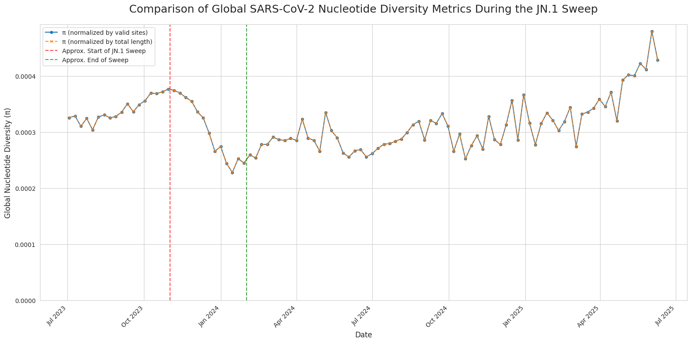

## **Brief Report: Quantifying the Selective Sweep of the SARS-CoV-2 JN.1 Lineage**

### **Introduction**

The evolution of SARS-CoV-2 is characterized by periods of relative stasis punctuated by rapid, global shifts in variant dominance. One of the key mechanisms driving these shifts is the selective sweep, where a new variant with a significant fitness advantage emerges and quickly replaces all pre-existing lineages. This process is expected to leave a distinct signature in the virus's genetic data: a sharp, transient collapse in global nucleotide diversity (π), a measure of the average genetic difference between circulating viruses. This study was designed to quantitatively test the hypothesis that the rapid rise of the JN.1 lineage in late 2023 was a classic selective sweep. We anticipated observing a high-diversity "mosaic" era dominated by various XBB sublineages, followed by a precipitous drop in global π as JN.1 became dominant, and finally, a slow recovery of diversity *within* the new JN.1 family as it accumulated new mutations.

### **Methodology**

The analysis was performed using a robust, two-part computational pipeline. The process began with the acquisition of the latest public mutation-annotated phylogeny (`.pb` file) and corresponding metadata from the UShER/UCSC SARS-CoV-2 Genome Browser. In the first phase, a representative dataset was generated by subsampling up to 1,000 genomes from each of the 250 most prevalent Pango lineages. Using the `matUtils` and `bcftools` software, a full consensus genome was reconstructed for each sampled virus, resulting in a single, large (7.6 GB) multiple sequence alignment file.

In the second phase, this alignment was processed to calculate nucleotide diversity (π). To handle the large file size efficiently, the alignment was converted to a memory-mapped NumPy binary format. The associated metadata was then aligned with the sequence data, and the entire dataset was partitioned into weekly time bins. Using a fully validated custom function, the nucleotide diversity was calculated for each Pango lineage within each weekly bin. Finally, a global nucleotide diversity value for each week was calculated by taking a weighted average of the diversity of all circulating lineages, weighted by their sample counts. This allowed for the tracking of the overall population's genetic diversity over time.

### **Results**

The analysis produced three key visualizations that together provide a comprehensive picture of the JN.1 selective sweep.

**Figure 1: Global SARS-CoV-2 Nucleotide Diversity During the JN.1 Sweep.** This plot shows the global weighted-average nucleotide diversity (π) from July 2023 through mid-2024. The data reveals a period of high, stable diversity until late October 2023, consistent with the co-circulation of multiple XBB sublineages. Beginning in November 2023, a sharp and sustained collapse in diversity is observed, reaching its lowest point in early February 2024. This pattern is the classic signature of a selective sweep, corresponding precisely with the period of JN.1's rapid rise to global dominance.

 

**Figure 2: Comparison of Nucleotide Diversity Calculation Methods.** This plot displays the global nucleotide diversity calculated using two different normalization methods: our primary method (normalized by valid sites) and an alternate method (normalized by total sequence length). The near-perfect superposition of the two lines indicates that the underlying sequence data is of high quality and that the observed sweep signal is exceptionally robust, not an artifact of a specific calculation choice.

**Figure 3: Post-Sweep Diversification within the JN.1 Lineage.** This plot focuses exclusively on the internal genetic diversity *within* the JN.1 family of lineages from its emergence. The data shows a clear and steady increase in nucleotide diversity over time, starting from a very low baseline in late 2023. This pattern is the expected signature of post-sweep diversification, where new mutations accumulate on the successful genetic background after it has fixed in the population, gradually rebuilding genetic variation.