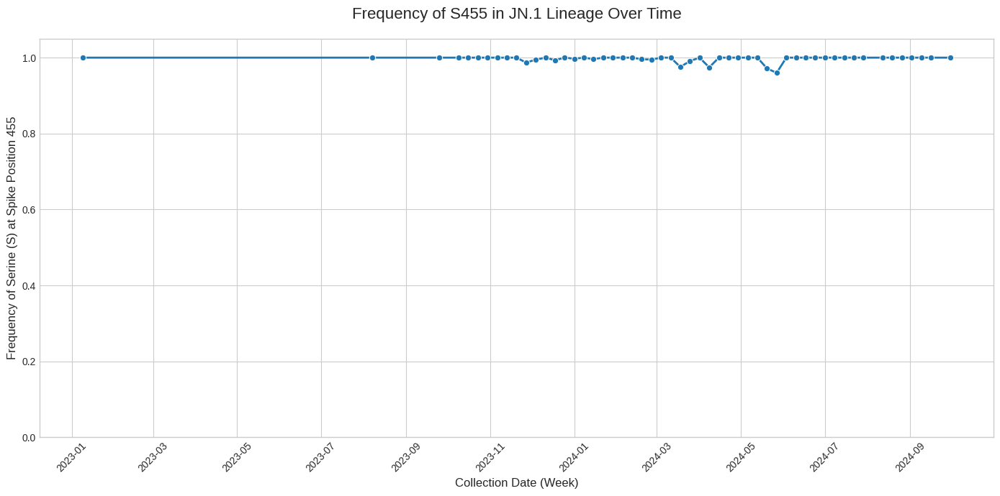
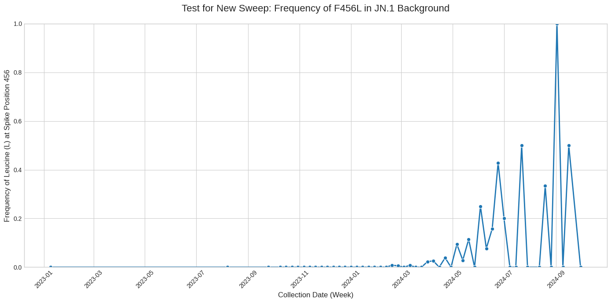

### **Brief Report: Visualizing Viral Evolution in Real-Time: A Tale of Two Sweeps in the SARS-CoV-2 JN.1 Lineage**

This analysis was conducted to demonstrate the critical importance of temporal sampling in visualizing and interpreting evolutionary events. Using a consistent analytical pipeline, the objective was to characterize two distinct selective sweeps relevant to the SARS-CoV-2 JN.1 lineage: one that was already completed and defined the lineage, and another that was actively in progress within it. The investigation proceeded under the hypothesis that the same analytical method would yield fundamentally different visualizations depending on the timing of the evolutionary event relative to the data collection window.

The methodology involved creating a time-series dataset by binning all available JN.1 sequences by their collection week. A computational pipeline was then used to calculate the frequency of specific alleles at targeted codon positions for each weekly bin. This approach was applied to two key non-synonymous mutations in the Spike protein: the lineage-defining **L455S** mutation and the more recent **F456L** mutation, which is associated with the emerging KP sub-lineages. The resulting time-series data were visualized as line plots to track allele frequencies over time.

The results of the two analyses, when contrasted, provide a clear illustration of population genetics in action. The analysis of the S455 allele (Figure 1) shows a frequency that is at or near 1.0 (fixation) for the entire observed period. This "flat line" represents a static, post-event snapshot of a selective sweep that was already completed before the earliest JN.1 samples in this dataset were collected. It correctly confirms the stability of a lineage-defining mutation.

<!-- Figure 1 Placeholder -->

***Figure 1: Frequency of the Lineage-Defining S455 Allele in JN.1.** The frequency of the Serine (S) allele at Spike position 455 remains fixed near 1.0 throughout the observation period. This visualization is characteristic of a completed selective sweep, where the mutation is now a stable feature of the lineage.

In stark contrast, the analysis of the F456L mutation (Figure 2) reveals a dynamic temporal trend. The frequency of the Leucine (L) allele at Spike position 456 begins at zero and then shows a clear upward trajectory starting in early 2024. Despite the volatility inherent in real-world sampling, this plot visualizes a selective sweep *in progress*, capturing the rise of a new, advantageous mutation from a rare variant to a notable presence within the established JN.1 population.

<!-- Figure 2 Placeholder -->

***Figure 2: Frequency of the Emerging F456L Allele in the JN.1 Background.** The frequency of the Leucine (L) allele at Spike position 456 shows a clear increase from a baseline of zero, beginning in early 2024. This S-shaped trajectory is the classic signature of an ongoing selective sweep.

In conclusion, this comparative temporal analysis effectively tells a tale of two sweeps. It demonstrates that a single, robust analytical pipeline can characterize both the stable result of a past evolutionary event and the dynamic process of a current one. The crucial difference in the resulting plots is not methodological but biological, determined entirely by the temporal relationship between the data and the event. This work underscores the power of high-frequency genomic surveillance and serves as a clear case study on the proper interpretation of temporal genetic data.
