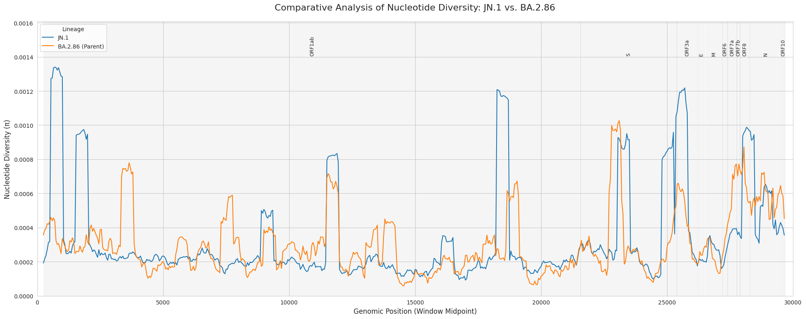

### **Brief Report: A Comparative Genomic Analysis of SARS-CoV-2 Lineages JN.1 and BA.2.86**

This analysis was conducted to characterize the evolutionary divergence of the SARS-CoV-2 JN.1 lineage from its immediate ancestor, BA.2.86. By systematically comparing their genomic diversity profiles, the objective was to identify specific adaptations that could explain the distinct epidemiological success of JN.1. The investigation proceeded under the hypothesis that while the two lineages would share a broad genetic architecture, key regions in the JN.1 genome would exhibit clear signals of recent and strong positive selection.

To achieve this, a multi-stage computational pipeline was employed. First, comprehensive sequence datasets for both the JN.1 and BA.2.86 lineages were isolated from a larger public repository. A sliding window analysis was then performed on each group to calculate nucleotide diversity (π) across the entire genome, generating a high-resolution diversity profile. These profiles were subsequently plotted on a single comparative graph, with genomic features from a reference GFF3 file overlaid to provide critical biological context. The final stage involved a targeted codon-level analysis of specific genes of interest to identify non-synonymous mutations that were significantly enriched in the JN.1 lineage.

The comparative analysis of the genomic diversity profiles revealed a dual evolutionary pattern. A general reduction in baseline nucleotide diversity was observed across the JN.1 genome relative to its BA.2.86 parent, a finding consistent with the occurrence of a recent selective sweep or population bottleneck. In contrast to this genome-wide purification, specific loci exhibited significantly amplified peaks of diversity in JN.1, most notably within the Spike (S) gene and the region encoding ORF3a. This indicates that while much of the ancestral variation was purged, these specific genes experienced intense diversifying selection.

<!-- Figure 1 Placeholder -->

***Figure 1: Comparative Nucleotide Diversity (π) in JN.1 and BA.2.86.** Sliding window analysis (500 bp window, 50 bp step) of nucleotide diversity across the SARS-CoV-2 genome. The JN.1 lineage (blue) shows a lower baseline diversity than its parent, BA.2.86 (orange), but exhibits amplified diversity peaks in specific gene regions, including Spike (S) and ORF3a.*

To identify the precise drivers of this divergence, the codon-level analysis focused on these regions of high diversity. This investigation pinpointed the **L455S** mutation—a change from Leucine to Serine at position 455—in the Receptor-Binding Domain (RBD) of the Spike protein as the most significant differentiating feature. This mutation was found to be at near-fixation (99.7%) within the JN.1 population. Critically, it was also present at a low frequency in the ancestral BA.2.86 population, providing a clear example of positive selection acting upon standing genetic variation. No other mutations in the analyzed genes showed a comparable signal of strong directional selection.

<!-- Figure 2 Placeholder (as a Markdown Table) -->
| Gene | Codon Position | Mutation | Ref. AA | JN.1 Consensus AA | JN.1 Frequency | BA.2.86 Consensus AA | BA.2.86 Frequency |
| :--- | :------------- | :------- | :------ | :---------------- | :------------- | :------------------- | :---------------- |
| S    | 455            | L455S    | L       | S                 | 0.997          | L                    | 0.888             |

***Table 1: Enriched Non-Synonymous Mutations in JN.1.** Results of the comparative codon analysis. The L455S mutation in the Spike gene is identified as being nearly fixed in the JN.1 lineage while remaining a minor variant in the ancestral BA.2.86 population, indicating strong positive selection.*

In conclusion, this analysis supports a dual evolutionary narrative for JN.1: it emerged from a genetic background that was refined by a selective sweep and was subsequently driven to high fitness by strong positive selection on a key pre-existing mutation. The identification of the L455S substitution as the primary candidate for this adaptation aligns with established findings in the scientific literature, which have experimentally validated its role in enhancing ACE2 receptor binding and, consequently, viral transmissibility. The analytical framework used here has demonstrated its robustness as a method for progressing from broad genomic surveillance data to the identification of specific, functionally significant evolutionary events.
