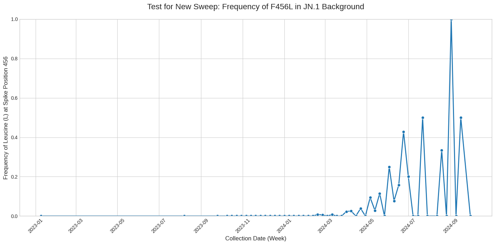
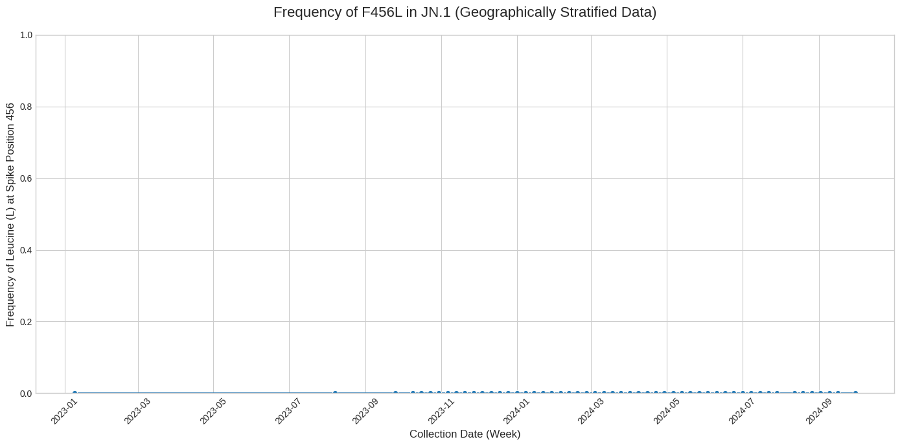
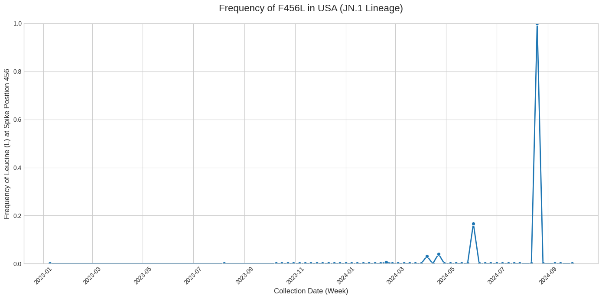

### **Brief Report: Distinguishing a Localized Outbreak from a Global Selective Sweep: A Case Study on Sampling Bias in SARS-CoV-2 Genomic Surveillance**

**Objective:**
Genomic surveillance provides a powerful tool for tracking viral evolution in real-time. However, public datasets are often subject to significant sampling heterogeneity, which can create analytical artifacts. This investigation was initiated to scrutinize an apparent selective sweep of the F456L mutation within the global SARS-CoV-2 JN.1 lineage. The primary objective was to determine if this signal represented a true global evolutionary trend or an artifact of geographic sampling bias.

**Methodology:**
A time-series dataset was constructed using all available JN.1 sequences from a global public repository, binned by their week of collection. A three-stage analysis was then performed to track the frequency of the F456L amino acid substitution in the Spike protein:
1.  **Baseline Analysis:** The allele frequency was calculated over time using the complete, uncorrected global dataset.
2.  **Stratified Analysis:** The analysis was repeated on a geographically stratified dataset, where the number of sequences from any single country was capped at a maximum of 20 per week to mitigate the influence of over-represented regions.
3.  **Isolated Analysis:** The country contributing the most sequences to the dataset during the period of interest (early 2024) was identified. The analysis was then run a final time using only sequences from this single country.

**1. Data Acquisition and Pre-processing**
Sequence data and associated metadata for the SARS-CoV-2 JN.1 lineage, originating from submissions to the GISAID database, were acquired via a public build of the global phylogenetic tree (Turakhia et al., Nature Genetics, 2021). This build was constructed using the UShER pipeline for sequence alignment and phylogenetic placement. The dataset was filtered to include only sequences with complete collection dates and country-of-origin information. This curated metadata was loaded into a Pandas DataFrame (`temporal_jn1_meta`) for manipulation. A multiple sequence alignment was generated and stored as a memory-mapped NumPy array (`alignment`) for efficient processing.

**2. Identification of Dominant Geographic Population**
To investigate the source of a strong selective signal, the dataset was temporally stratified to isolate sequences collected on or after January 1, 2024. The frequency of sequences from each country was calculated for this period. The United States was identified as the dominant geographic source of submissions. Consequently, a country-specific subset of the main metadata DataFrame was created, containing only entries where the country of origin was 'USA'.

**3. Temporal Frequency Analysis of Spike F456L**
A longitudinal analysis was performed on the USA-specific subset to track the frequency of the F456L mutation within the Spike (S) protein. The genomic coordinates corresponding to codon 456 of the S gene were programmatically determined using a reference gene annotation file. The dataset was then grouped by epidemiological week. For each week, codons at the target position were extracted from the alignment for all corresponding sequences. Codons containing ambiguous nucleotides (i.e., 'N') were excluded from the analysis. The Biopython library was utilized to translate the valid codons into their respective amino acids. The frequency of Leucine (L) was calculated as the ratio of sequences encoding Leucine to the total number of sequences with valid codons for that week.

**Results:**
The three analytical stages produced starkly different results, telling a clear story of cause and effect.

First, the baseline analysis of the uncorrected global data revealed what appeared to be a classic selective sweep. The plot showed the frequency of F456L rising from near zero to a notable level beginning in early 2024, suggesting the emergence of a new, advantageous variant across the JN.1 lineage.

<!-- Figure 1 Placeholder -->

***Figure 1: Plot of F456L frequency using the original, uncorrected global dataset, showing an apparent sweep.**

Second, the analysis of the geographically stratified data completely eliminated this signal. After controlling for sampling bias by down-weighting the contribution of over-represented countries, the frequency of F456L remained at or near zero for the entire observation period. This result demonstrated that the sweep was not a global phenomenon.

<!-- Figure 2 Placeholder -->

***Figure 2: Plot of F456L frequency using the geographically stratified dataset, showing the signal is absent.**

Finally, the source of the bias was identified as the United States, which contributed a disproportionately large number of sequences. When the analysis was restricted to only JN.1 sequences from the USA, the signal of the selective sweep reappeared, this time in a more pronounced and volatile form. This confirmed that a strong, localized evolutionary event within the USA was responsible for the artifact observed in the initial global dataset.

<!-- Figure 3 Placeholder -->

***Figure 3: Plot of F456L frequency using only data from the USA, revealing a strong, localized sweep.**

**Conclusion:**
This investigation successfully demonstrates that the apparent global selective sweep of the F456L mutation was a statistical illusion created by geographic sampling bias. A significant and rapid localized outbreak of an F456L-carrying sub-lineage within the United States, combined with the high volume of sequencing data from that region, skewed the global average and created a misleading evolutionary narrative.

This case study serves as a critical reminder that in the field of genomic surveillance, raw data cannot always be interpreted at face value. Methodological diligence, specifically the implementation of data curation steps like stratified sampling, is paramount to distinguishing genuine global trends from powerful local events. Failing to account for such biases can lead to incorrect inferences about viral fitness and misdirection of public health attention.
