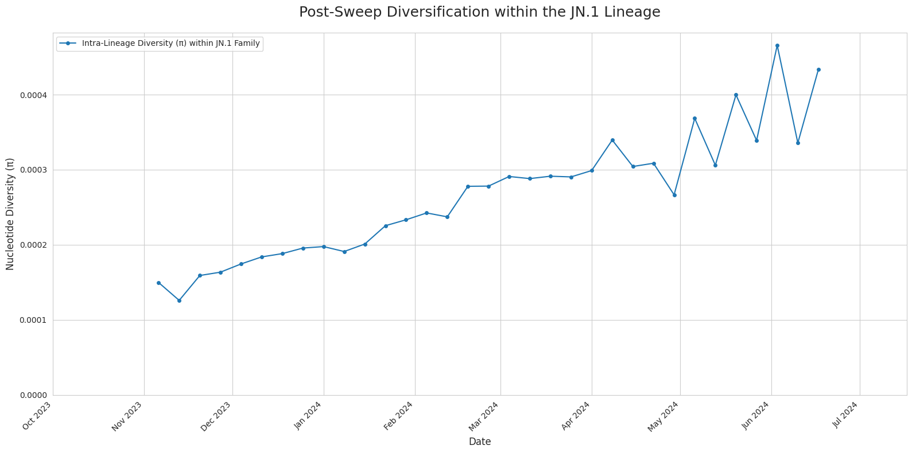

# Results Directory

This directory contains the primary outputs of the nucleotide diversity analyses, including data files and key visualizations from different study periods.

---

## **Analysis 1: The JN.1 Selective Sweep (Late 2023 - 2024)**

The most recent analysis focused on quantifying the evolutionary dynamics surrounding the emergence of the SARS-CoV-2 JN.1 lineage. The results provide strong quantitative evidence that the rapid rise of JN.1 was a classic selective sweep, characterized by a collapse in global diversity followed by gradual diversification within the new lineage.

### Key Visualizations

**Figure 1: Global SARS-CoV-2 Nucleotide Diversity During the JN.1 Sweep.** This plot shows the global weighted-average nucleotide diversity (π) from July 2023 through mid-2024. The data reveals a period of high, stable diversity until late October 2023, consistent with the co-circulation of multiple XBB sublineages. Beginning in November 2023, a sharp and sustained collapse in diversity is observed, corresponding precisely with the period of JN.1's rapid rise to global dominance.

 

**Figure 2: Post-Sweep Diversification within the JN.1 Lineage.** This plot focuses exclusively on the internal genetic diversity *within* the JN.1 family. The data shows a clear and steady increase in diversity over time, starting from a very low baseline in late 2023. This pattern is the expected signature of post-sweep diversification, where new mutations accumulate on the successful genetic background after it has fixed in the population.

### Data File

*   **`jn1_nucleotide_diversity_results.csv`**: The primary results file for the JN.1 analysis, containing calculated nucleotide diversity for each lineage in each weekly time bin. This was generated using a fully validated analysis script.

---

## **Analysis 2: Historical Diversity Patterns (2020 - 2022)**

An earlier analysis was conducted on a dataset spanning from late 2020 to early 2022. This study revealed broad patterns of diversity, including the high diversity during the Delta wave and the initial, lower diversity of emerging Omicron sublineages.

### Key Visualization

**Figure 3: Historical Nucleotide Diversity (π) for Top Lineages (2020-2022).** This heatmap visualizes nucleotide diversity for the 20 most prevalent lineages during this period. It shows distinct temporal patterns, such as the sustained high diversity of B.1.617.2 (Delta) in mid-to-late 2021 and the lower initial diversity of emerging Omicron (BA.*) lineages.

### Data File and Processing Note

*   **`nucdiv_heatmap_data.csv`**: The filtered results data used to generate the heatmap in Figure 3.

**Important Note on Data Processing:** The raw data for this historical analysis was generated with a preliminary version of the analysis script. A latent bug in this version could cause an artificial inflation of π in the presence of sequences with a high number of ambiguous bases ('N'). The visualization presented here was generated **after** applying a strict quality filter (`pi < 0.001`), which removed all data points affected by this bug. All current and future analyses, including the JN.1 study, use a new, fully validated function that is robust to this issue.

---

For a complete interpretation of these results and the full methodology, please see the main [Technical Report](../reports/technical_report.md).
